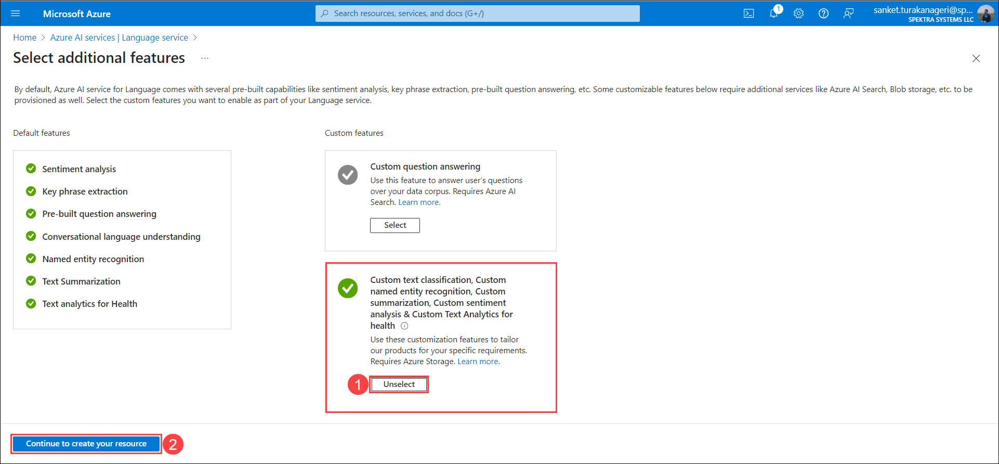
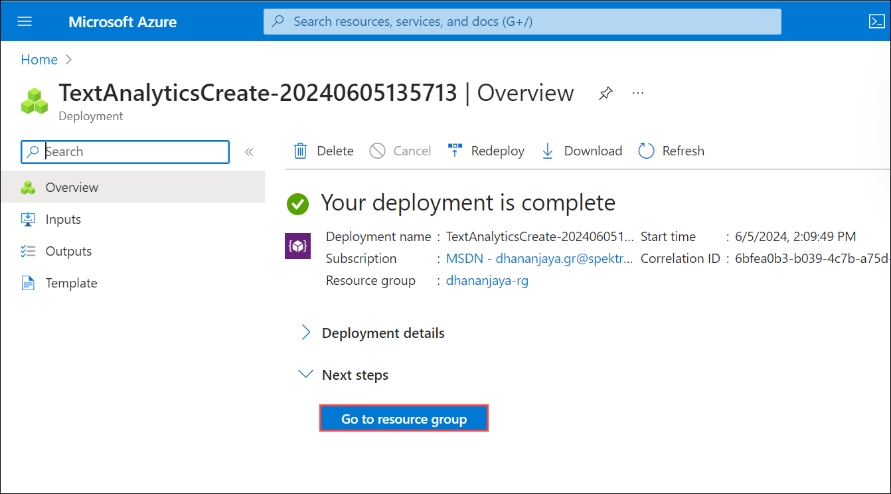

# Task 01 - Provision Azure AI Language Service

1. In the Azure portal, search for **Azure AI (1)** and select **Azure AI Services (2)** from the services list.

   

2. On the **Azure AI Services** blade, select **Language Sevice (1)** and click on **Create (2)**.

   

3. On the **Select additional features** blade, under **Custom features** settings, select **Custom text classification, Custom named entity recognition, Custom summarization, Custom sentiment analysis & Custom Text Analytics for health** and click on **Continue to create your resource**.

   
  
4. On the **Create Language** blade, under the **Basics** tab, enter the following details, click on **Review + create** and then **Create**.

   - Subscription: Select your Default Subscription
   - Resource group: Select your Default Resource group
   - Region: Select your Default Region
   - Name: language-service-DID
   - Pricing tier: Free Tier (F0)
   - New/Existing storage account: New storage account
   - Storage account name: openaistorageDID
   - Storage account type: Standard LRS
   - Check the box for the Responsible AI Notice

   

   
   
6. Wait for the deployment to succeed. Once the deployment is succeeded, click on **Go to resource group**.

   
