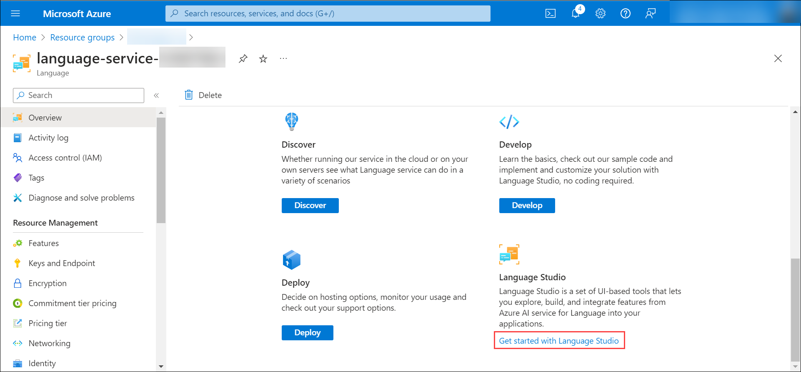
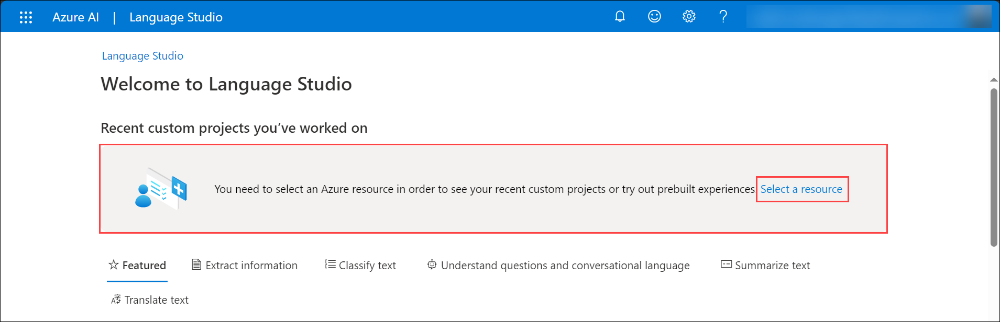
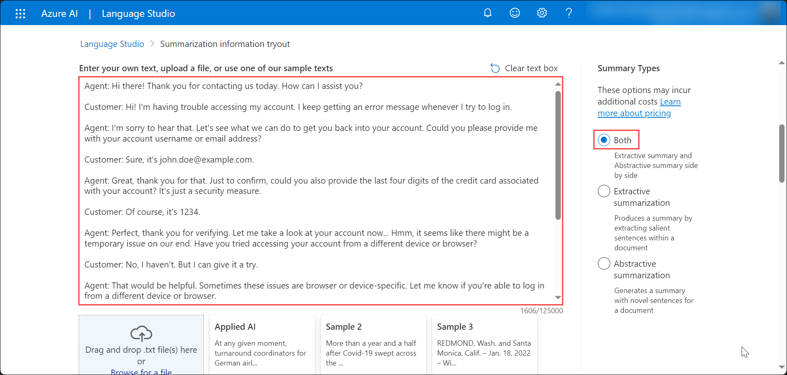
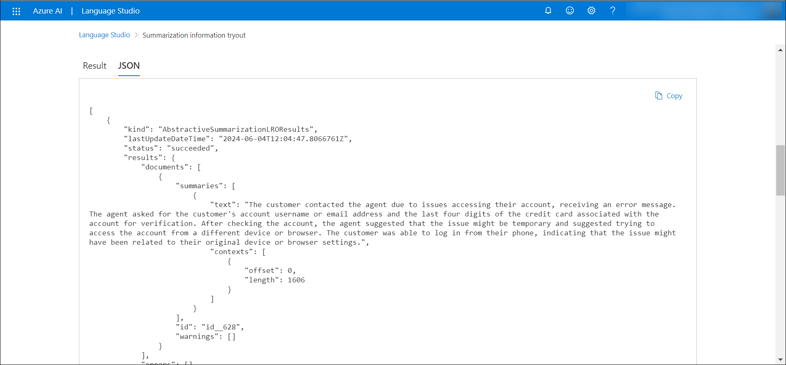

# Task 02 - Summarize the customer-agent conversation in Azure AI Language Studio

1. In the Azure portal, on the resource group blade, navigate to the **language-service-DID** Language service.

   

2. On the Language service Overview pane, under **Get Started**, select **Get started with Language Studio**.

   

3. The Language Studio opens up in a new tab, in the **Select an Azure resource**, for the Resource name dropdown, select your language service and click on **Done**.

   >**Note:** Sign in to Language Studio using your Azure credentials from the **Environmnet** tab if not signed-in already.
    
   >**Note:** Leave the Azure diectory, Azure subscription and Resource type as default.

   

   - If you don't get the Select an Azure Resource pop-up, then click on **Select a resource** in your Language Studio.

   
   
5. In your Azure AI Language Studio, in the **Featured** tab, select **Try it now** for the **Summarize information**.

   

6. On the **Summarize information** blade, under the **Documents** tab, select your preferred language, azure resource that you deployed, number of sentences you prefer in summary and specify your summary interest.

   

7. In the text box, copy and paste the below conversation between a customer and an agent. The conversation is about a customer having trouble accessing their account, verifying their identity, troubleshooting, and successfully resolving the issue.

   >**Note:** Select **Both** for Summary Types to get both the Extractive and Abstractive summarization.

   ```
   Agent: Hi there! Thank you for contacting us today. How can I assist you?

   Customer: Hi! I'm having trouble accessing my account. I keep getting an error message whenever I try to log in.

   Agent: I'm sorry to hear that. Let's see what we can do to get you back into your account. Could you please provide me with your account username or email address?

   Customer: Sure, it's john.doe@example.com.

   Agent: Great, thank you for that. Just to confirm, could you also provide the last four digits of the credit card associated with your account? It's just a security measure.

   Customer: Of course, it's 1234.

   Agent: Perfect, thank you for verifying. Let me take a look at your account now... Hmm, it seems like there might be a temporary issue on our end. Have you tried accessing your account from a different device or browser?

   Customer: No, I haven't. But I can give it a try.

   Agent: That would be helpful. Sometimes these issues are browser or device-specific. Let me know if you're able to log in from a different device or browser.

   (Customer tries accessing the account from another device.)

   Customer: It worked! I was able to log in from my phone.

   Agent: That's great to hear! It seems like the issue might be related to your original device or browser settings. If you encounter any further problems, feel free to reach out to us again. Is there anything else I can assist you with today?

   Customer: No, that's all for now. Thank you so much for your help!

   Agent: You're very welcome! If you have any other questions or concerns in the future, don't hesitate to contact us. Have a wonderful day!
   ```

   

8. Check the box to acknowledge and click on **Run**.

   

9. Once the model runs successfully, you will get both the extractive and abstractive summaries for the customer-agent conversarion on the **Result** tab based on the selected number of sentences in summary.

   

10. Review the **Rank Score** of the sentences under Original text.

    

11. You can also review the extractive and abstractive results in JSON foramt on the **JSON** tab.

    


