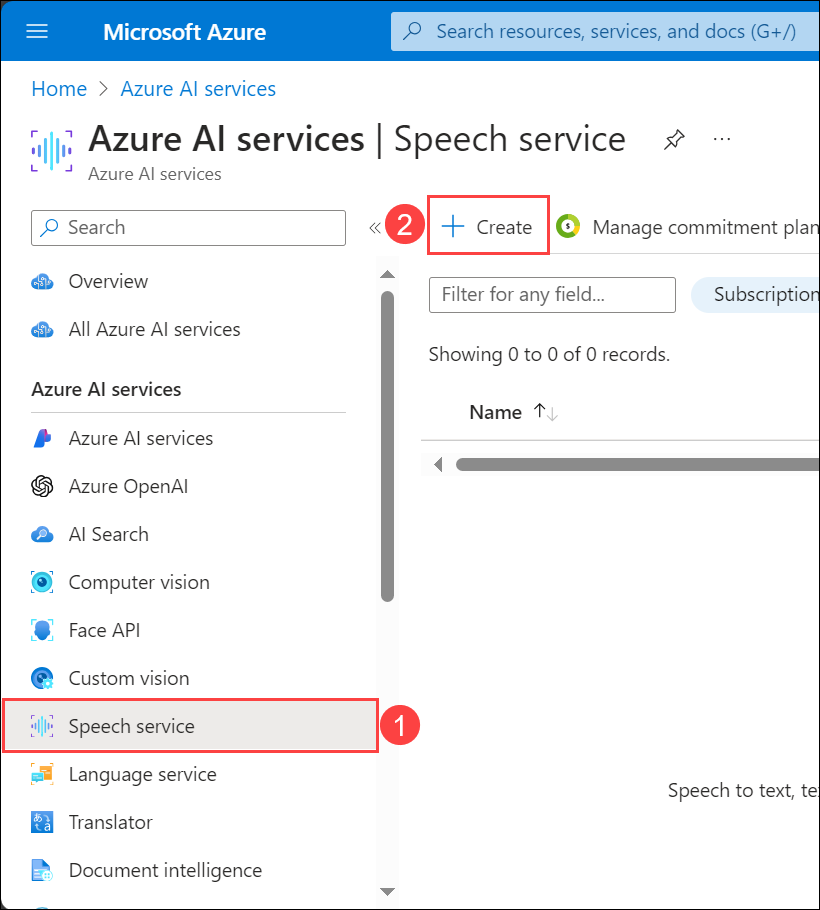
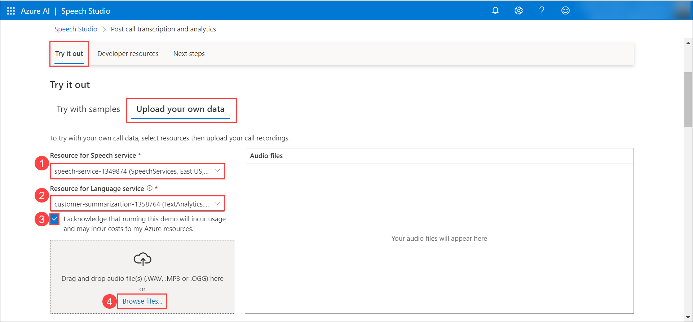

## Task 1 - Provision Azure AI Speech service

1. In the Azure portal, search for **Azure AI** and select **Azure AI Services** from the services list.

   

2. On the **Azure AI Services** blade, select **Speech Sevice (1)** and click on **Create (2)**.

   
  
3. On the **Create Speech Services** blade, under the **Basics** tab, enter the following details, click on **Review + create** and then **Create**.

   - Subscription: **Select your Default Subscription (1)**
   - Resource group: **Select your Default Resource Group (2)**
   - Region: **Select your Default Region (3)**
   - Name: **speech-service-<inject key="Deployment-ID" enableCopy="false"/> (4)**
   - Pricing tier: **Standard S0 (5)**
  
   

6. Wait for the deployment to succeed. Once the deployment is succeeded, click on **Go to resource**.

   

   <validation step="fdc5b686-2e7b-43db-ba7a-f69384575b3e" />

## Task 2 - Analyze sentences and call summary of audio recordings in Azure AI Speech Studio

1. In the Azure portal, on the resource group blade, navigate to the **speech-service-<inject key="Deployment-ID" enableCopy="false"/>** Speech service.

   

2. On the Speech service Overview pane, under **Get Started**, select **Go to Speech Studio**.

   

3. The Speech Studio opens up in a new tab, under **Speech capabilities by scenario**, click on **Try out post call transcription** for the **Post call transcription and analytics**.

   

4. The Post call transcription and analytics gives an overview of the **Call center transcription and analytics with Azure Speech and Language** and it's common use cases along with a few sample audio recordings of the customer-agent conversation where you can analyze the sentences and the call summary.

5. In the **Try it out > Try with Samples** tab, click on the **Play** button for listen to the sample audio conversation between the customer and the agent.

   

6. In the **Analyze sentences** tab, analyze the Sentiment and the Transcript between Speaker1 and Speaker2.

   

7. Turn Off the **Hide PII** toggle to view the Speakers' Personal Identifiable Information (PII).

   >**Note:** The **Hide PII** toggle is tuned On by default.

8. Once you have analyzed the sentences between the two speakers, click on the **Call summary** to view the **Issue summary** and the **Resolution summary** fo the conversation.

   

9. Now, let's try uploading custom audio recordings to analyze and fetch the call summary. In the **Try it out > Upload your own data** tab and configure the following details:

    - Resource for Speech service: **speech-service-<inject key="Deployment-ID" enableCopy="false"/> (1)**
    - Resource for Language service: **language-service-<inject key="Deployment-ID" enableCopy="false"/> (2)**
    - Acknowledge the checkbox **(3)**
    - Click on **Browse files... (4)** to upload the custom audio files
  
    

10. Navigate to **C:\LabFiles\Recordings** folder and upload the audio recordings individually and wait for the upload to complete.

    

11. Click on the **Play** button to listen to the audio file, analyze the sentences **(1)** and the call summary **(2)** of the uploaded audio recordings.

    

    
