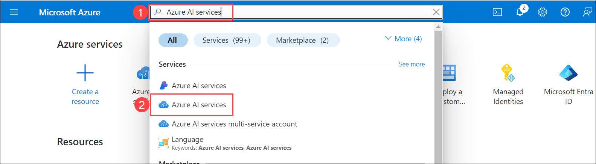
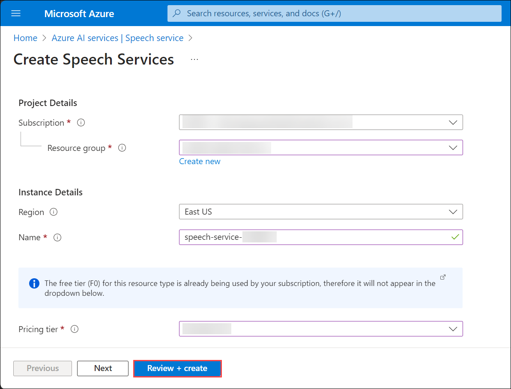
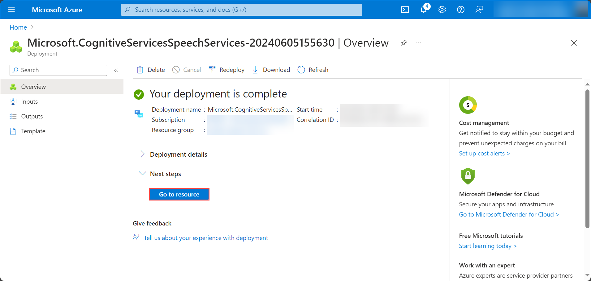

# Task 03 - Provision Azure AI Speech Service

1. In the Azure portal, search for **Azure AI** and select **Azure AI Services** from the services list.

   

2. On the **Azure AI Services** blade, select **Speech Sevice (1)** and click on **Create (2)**.

   
  
3. On the **Create Speech Services** blade, under the **Basics** tab, enter the following details, click on **Review + create** and then **Create**.

   - Subscription: Select your Default Subscription
   - Resource group: Select your Default Resource Group
   - Region: Select your Default Region
   - Name: speech-service-DID
   - Pricing tier: Free Tier (F0)
  
   

6. Wait for the deployment to succeed. Once the deployment is succeeded, click on **Go to resource**.

   
