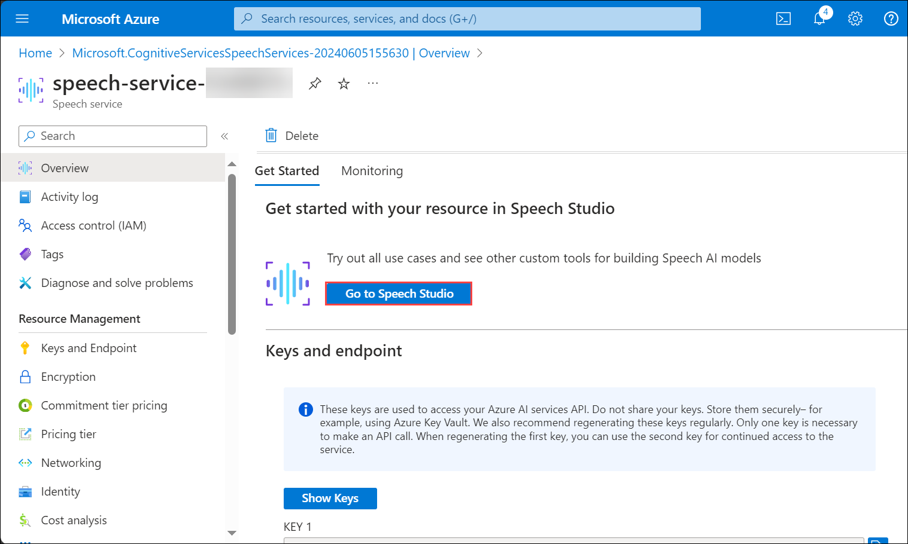
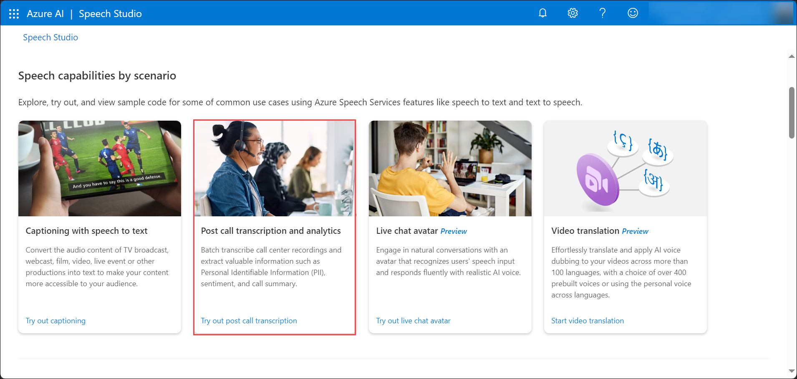
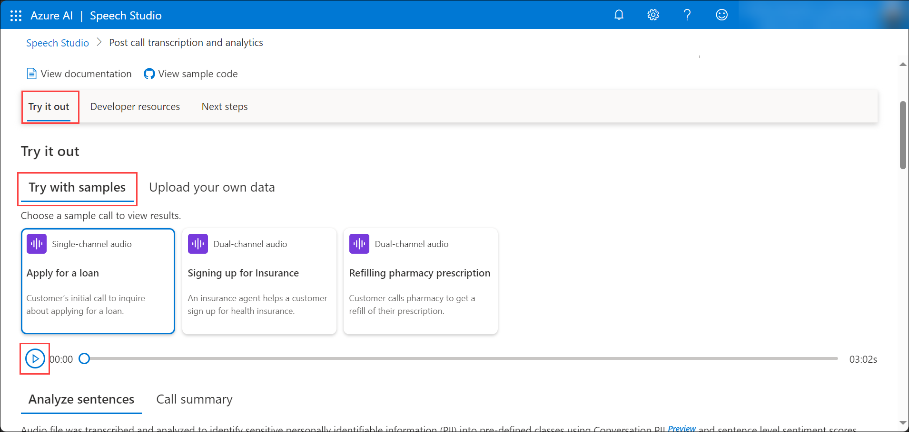
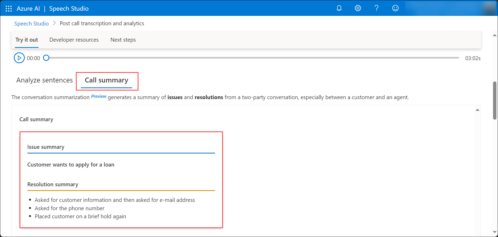

# Task 04 - Analyze sentences and Call Summary of audio recordings in Azure AI Speech Studio

1. In the Azure portal, on the resource group blade, navigate to the **speech-service-DID** Speech service.

2. On the Speech service Overview pane, under **Get Started**, select **Go to Speech Studio**.

   

3. The Speech Studio opens up in a new tab, under **Speech capabilities by scenario**, click on **Try out post call transcription** for the **Post call transcription and analytics**.

   

4. The Post call transcription and analytics gives an overview of the **Call center transcription and analytics with Azure Speech and Language** and it's common use cases along with a few sample audio recordings of the customer-agent conversation where you can analyze the sentences and the call summary.

5. In the **Try it out > Try with Samples** tab, click on the **Play** button for listen to the sample audio conversation between the customer and the agent.

   

6. In the **Analyze sentences** tab, analyze the Sentiment and the Transcript between Speaker1 and Speaker2.

   

7. Turn Off the **Hide PII** toggle to view the Speakers' Personal Identifiable Information (PII).

   >**Note:** The **Hide PII** toggle is tuned On by default.

8. Once you have analyzed the sentences between the two speakers, click on the **Call summary** to view the **Issue summary** and the **Resolution summary** fo the conversation.

   

