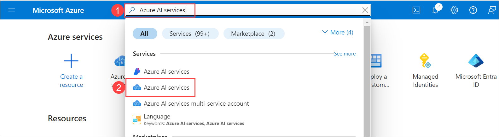
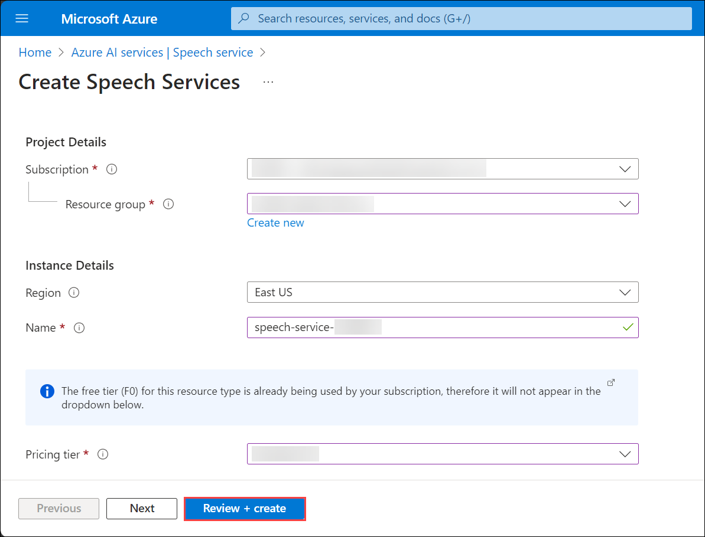
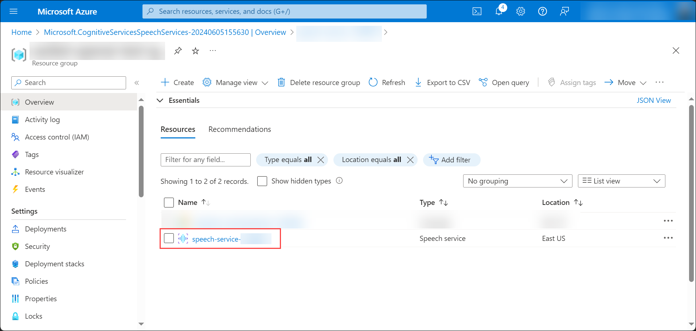

# Hands-On Lab - Customer Support Conversation Summarization with Azure OpenAI

## Task 01 - Provision Azure AI Language Service

1. In the Azure portal, search for **Azure AI (1)** and select **Azure AI Services (2)** from the services list.

   

2. On the **Azure AI Services** blade, select **Language Sevice (1)** and click on **Create (2)**.

   

3. On the **Select additional features** blade, under **Custom features** settings, select **Custom text classification, Custom named entity recognition, Custom summarization, Custom sentiment analysis & Custom Text Analytics for health** and click on **Continue to create your resource**.

   
  
4. On the **Create Language** blade, under the **Basics** tab, enter the following details, click on **Review + create** and then **Create**.

   - Subscription: Select your Default Subscription
   - Resource group: Select your Default Resource group
   - Region: Select your Default Region
   - Name: language-service-DID
   - Pricing tier: Free Tier (F0)
   - New/Existing storage account: New storage account
   - Storage account name: openaistorageDID
   - Storage account type: Standard LRS
   - Check the box for the Responsible AI Notice

   

   
   
6. Wait for the deployment to succeed. Once the deployment is succeeded, click on **Go to resource group**.

   

## Task 02 - Summarize the customer-agent conversation in Azure AI Language Studio

1. In the Azure portal, on the resource group blade, navigate to the **language-service-DID** Language service.

   

2. On the Language service Overview pane, under **Get Started**, select **Get started with Language Studio**.

   

3. The Language Studio opens up in a new tab, in the **Select an Azure resource**, for the Resource name dropdown, select your language service and click on **Done**.

   >**Note:** Sign in to Language Studio using your Azure credentials from the **Environmnet** tab if not signed-in already.
    
   >**Note:** Leave the Azure diectory, Azure subscription and Resource type as default.

   

   - If you don't get the Select an Azure Resource pop-up, then click on **Select a resource** in your Language Studio.

   
   
5. In your Azure AI Language Studio, in the **Featured** tab, select **Try it now** for the **Summarize information**.

   

6. On the **Summarize information** blade, under the **Documents** tab, select your preferred language, azure resource that you deployed, number of sentences you prefer in summary and specify your summary interest.

   

7. In the text box, copy and paste the below conversation between a customer and an agent. The conversation is about a customer having trouble accessing their account, verifying their identity, troubleshooting, and successfully resolving the issue.

   >**Note:** Select **Both** for Summary Types to get both the Extractive and Abstractive summarization.

   ```
   Agent: Hi there! Thank you for contacting us today. How can I assist you?

   Customer: Hi! I'm having trouble accessing my account. I keep getting an error message whenever I try to log in.

   Agent: I'm sorry to hear that. Let's see what we can do to get you back into your account. Could you please provide me with your account username or email address?

   Customer: Sure, it's john.doe@example.com.

   Agent: Great, thank you for that. Just to confirm, could you also provide the last four digits of the credit card associated with your account? It's just a security measure.

   Customer: Of course, it's 1234.

   Agent: Perfect, thank you for verifying. Let me take a look at your account now... Hmm, it seems like there might be a temporary issue on our end. Have you tried accessing your account from a different device or browser?

   Customer: No, I haven't. But I can give it a try.

   Agent: That would be helpful. Sometimes these issues are browser or device-specific. Let me know if you're able to log in from a different device or browser.

   (Customer tries accessing the account from another device.)

   Customer: It worked! I was able to log in from my phone.

   Agent: That's great to hear! It seems like the issue might be related to your original device or browser settings. If you encounter any further problems, feel free to reach out to us again. Is there anything else I can assist you with today?

   Customer: No, that's all for now. Thank you so much for your help!

   Agent: You're very welcome! If you have any other questions or concerns in the future, don't hesitate to contact us. Have a wonderful day!
   ```

   

8. Check the box to acknowledge and click on **Run**.

   

9. Once the model runs successfully, you will get both the extractive and abstractive summaries for the customer-agent conversarion on the **Result** tab based on the selected number of sentences in summary.

   

10. Review the **Rank Score** of the sentences under Original text.

    

11. You can also review the extractive and abstractive results in JSON foramt on the **JSON** tab.

    

## Task 03 - Provision Azure AI Speech Service

1. In the Azure portal, search for **Azure AI** and select **Azure AI Services** from the services list.

   

2. On the **Azure AI Services** blade, select **Speech Sevice (1)** and click on **Create (2)**.

   
  
3. On the **Create Speech Services** blade, under the **Basics** tab, enter the following details, click on **Review + create** and then **Create**.

   - Subscription: Select your Default Subscription
   - Resource group: Select your Default Resource Group
   - Region: Select your Default Region
   - Name: speech-service-DID
   - Pricing tier: Free Tier (F0)
  
   

6. Wait for the deployment to succeed. Once the deployment is succeeded, click on **Go to resource**.

   

## Task 04 - Analyze sentences and Call Summary of audio recordings in Azure AI Speech Studio

1. In the Azure portal, on the resource group blade, navigate to the **speech-service-DID** Speech service.

   

2. On the Speech service Overview pane, under **Get Started**, select **Go to Speech Studio**.

   

3. The Speech Studio opens up in a new tab, under **Speech capabilities by scenario**, click on **Try out post call transcription** for the **Post call transcription and analytics**.

   

4. The Post call transcription and analytics gives an overview of the **Call center transcription and analytics with Azure Speech and Language** and it's common use cases along with a few sample audio recordings of the customer-agent conversation where you can analyze the sentences and the call summary.

5. In the **Try it out > Try with Samples** tab, click on the **Play** button for listen to the sample audio conversation between the customer and the agent.

   

6. In the **Analyze sentences** tab, analyze the Sentiment and the Transcript between Speaker1 and Speaker2.

   

7. Turn Off the **Hide PII** toggle to view the Speakers' Personal Identifiable Information (PII).

   >**Note:** The **Hide PII** toggle is tuned On by default.

8. Once you have analyzed the sentences between the two speakers, click on the **Call summary** to view the **Issue summary** and the **Resolution summary** fo the conversation.

   
