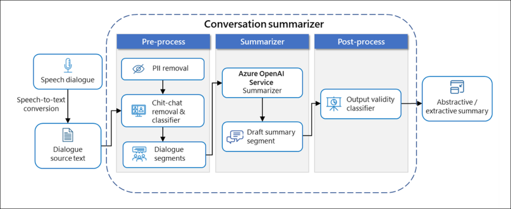
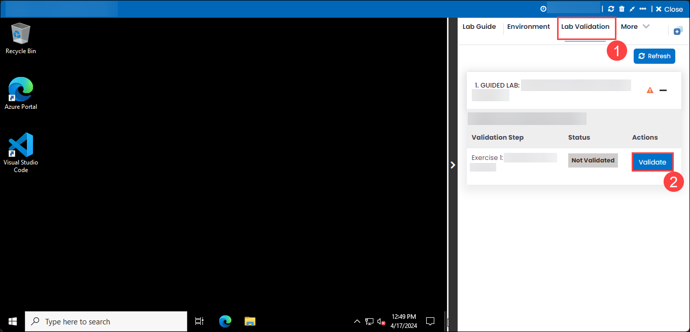

# Customer Support Conversation Summarization with Azure OpenAI

### Overall Estimated Duration: 2 hours

## Overview

Most businesses provide customer service support to help customers with product queries, troubleshooting, and maintaining or upgrading features or the product itself. To provide a satisfactory resolution, customer support specialists need to respond quickly with accurate information. OpenAI can help organizations with customer support in a variety of ways. Learn how to generate summaries of customer-agent interactions in various customer support scenarios by using the Azure OpenAI model. The focus of this lab is to provide efficient and accurate summarization of conversations, improving the quality of customer support. 

## Objective

This lab is designed to equip participants with hands-on experience to use Azure OpenAI to summarize customer support conversations, extracting key insights and main points from the interactions.

- **Summarize the customer-agent conversation in Azure AI Language Studio:** Use Azure AI Language Studio to generate concise summaries of customer-agent conversations for improved understanding and analysis.
  
- **Analyze sentences and call summary of audio recordings in Azure AI Speech Studio:** Analyze sentences and generate call summaries from audio recordings using Azure AI Speech Studio.

## Prerequisites

Participants should have:

- **Basic Understanding of AI and NLP:** Familiarity with natural language processing concepts and AI fundamentals.
- **Azure Subscription:** An active Azure subscription to access and use Azure AI services.
- **Access to Azure AI Language Studio and Azure AI Speech Studio:** Permissions and access to these Azure services to perform the tasks.
- **Familiarity with Azure Portal:** Basic knowledge of navigating the Azure Portal to provision and manage services.
- **Understanding of Speech-to-Text and Text Summarization:** Knowledge of how speech-to-text conversion and text summarization work.
- **Basic Knowledge of Audio and Text Data Processing:** Understanding the processes involved in handling and analyzing audio and text data.

## Architechture

In this hands-on lab, you will provision Azure AI Language and Speech services, use them to summarize customer-agent conversations in Azure AI Language Studio, and analyze sentences and call summaries from audio recordings in Azure AI Speech Studio.

## Architechture Diagram

## Explanation of Components

The architecture for this lab involves the following key components:

- **Azure AI Language service:** Azure AI Language service provides advanced text analytics, including sentiment analysis, entity recognition, and language understanding to extract actionable insights from text.
- **Azure AI Speech service:** Azure AI Speech service converts spoken language into text and provides features for speech recognition, transcription, and natural language understanding.

## Getting Started with the Lab
 
Welcome to your Customer Support Conversation Summarization with Azure OpenAI Workshop! We've prepared a seamless environment for you to explore and learn about Azure services. Let's begin by making the most of this experience:
 
## Accessing Your Lab Environment
 
Once you're ready to dive in, your virtual machine and lab guide will be right at your fingertips within your web browser.

  

### Virtual Machine & Lab Guide
 
Your virtual machine is your workhorse throughout the workshop. The lab guide is your roadmap to success.
 
## Exploring Your Lab Resources
 
To get a better understanding of your lab resources and credentials, navigate to the **Environment** tab.
 
  
 
## Utilizing the Split Window Feature
 
For convenience, you can open the lab guide in a separate window by selecting the **Split Window** button from the Top right corner.
 
  
 
## Managing Your Virtual Machine
 
Feel free to start, stop, or restart your virtual machine as needed from the **Resources** tab. Your experience is in your hands!

  

## Lab Validation

1. After completing the task, hit the **Validate** button under Validation tab integrated within your lab guide. If you receive a success message, you can proceed to the next task, if not, carefully read the error message and retry the step, following the instructions in the lab guide.

   

1. You can also validate the task by navigating to the **Lab Validation** tab, from the upper right corner in the lab guide section.

   

1. If you need any assistance, please contact us at labs-support@spektrasystems.com.

## Let's Get Started with Azure Portal
 
1. On your virtual machine, click on the **Azure Portal** icon as shown below:
 
    

1. On the **Sign in to Microsoft Azure** tab you will see the login screen, in that enter the following email/username, and click on **Next**. 

   * **Email/Username**: <inject key="AzureAdUserEmail"></inject>
   
      
     
1. Now enter the following password and click on **Sign in**.
   
   * **Password**: <inject key="AzureAdUserPassword"></inject>
   
      

1. If you see the pop-up Action Required, click Ask Later.

   

   >**NOTE:** Do not enable MFA, select **Ask Later**.
     
1. If you see the pop-up **Stay Signed in?**, select **No**.

1. If you see the pop-up **You have free Azure Advisor recommendations!**, close the window to continue the lab.

1. If a **Welcome to Microsoft Azure** popup window appears, select **Maybe Later** to skip the tour.
   
## Support Contact
 
The CloudLabs support team is available 24/7, 365 days a year, via email and live chat to ensure seamless assistance at any time. We offer dedicated support channels tailored specifically for both learners and instructors, ensuring that all your needs are promptly and efficiently addressed.

Learner Support Contacts:
- Email Support: labs-support@spektrasystems.com
- Live Chat Support: https://cloudlabs.ai/labs-support

Now, click on **Next** from the lower right corner to move on to the next page.

### Happy Learning!!
